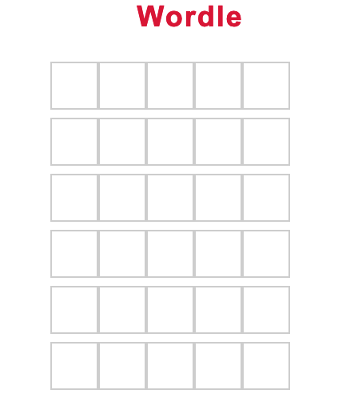

# Spring Wordle #

### Summary ###
This project is a barebones clone of the game Wordle built with Spring Boot. The main purpose of this project was for me to get experience with how Spring Boot works along with how a web application is built. Main branch grabs wordlist from a github repository. To see code for grabbing words from a mysql database check out the *mysql* branch.

### Installing/Running ###
Clone this repo: 
`git clone https://github.com/Marcusk19/springwordle.git` 
`cd springwordle` 
Then you can build and run the project using gradle: 
`gradle build` 
`java -jar build/libs/spring_wordle-1.1.jar` 
Navigate to localhost and you should see the application. 

